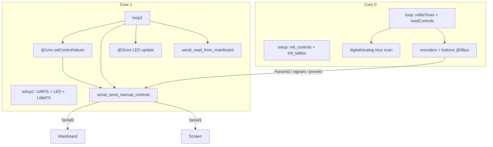

# Input Controller — control pipeline

How front-panel activity becomes Mainboard / Screen traffic on **DCO4_Input_Controller**.

---

## Dual-core split

---

## Soft timers

| Core | Flag | Work |
|------|------|------|
| 0 | ~1 ms | Full digital mux + analog sample |
| 0 | other | Digital mux only (no analog) |
| 0 | ~99 µs | `read_encoders` + `read_encoder_buttons` |
| 1 | ~1 ms | Map faders/pots → locals; TX manual blocks |
| 1 | ~5 ms | May set ADSR3 send flag |
| 1 | ~31 µs/ms | LED mux update |
| 1 | always | Inbound `'x'` parser |

---

## Outbound: Mainboard (`Serial2`)

Peer is Mainboard **Serial8** (not the DCO). Older comments saying “to DCO” are wrong for current topology.

| When | Cmd | Content |
|------|-----|---------|
| Manual ADSR1 / preset load | `'a'` | 8 bytes A/D/S/R (**exp-mapped** via `linToExpLookup`) |
| Manual ADSR2 | `'b'` | Same for ADSR2 |
| Manual ADSR3 | `'c'` | Exp-mapped ADSR3 (Serial2 only) |
| Manual VCF pots | `'d'` | CUTOFF, RESONANCE, ADSR2toVCF, LFO2toVCF |
| Manual VCA pot | `'e'` | ADSR1toVCA |
| Manual PW pot | `'f'` | PW |
| Encoder/button ParamId | `'p'` / `'w'` | Via `serial_send_param_change*` |
| Preset name (8 chars) | `'q'` | `serial_send_preset_name_to_mainboard` |

`serial_send_manual_controls(presetLoading)` gates blocks on the `*ControlManual` flags (or forces all when loading a preset).

---

## Outbound: Screen (`Serial1`)

| Cmd | Role |
|-----|------|
| `'a'` / `'b'` | ADSR1/2 **raw** fader values (UI bars) |
| `'q'` | Preset scroll: number + **16**-char name |
| `'s'` | UI mode signals (load/save flow — list in `Serial.h`) |
| `'c'` | Save char-position select |
| `'y'` | Byte param to screen |
| `'p'` / `'w'` | When `sendToAll` |

---

## Inbound

Live path: `serial_read_from_mainboard()` on **Serial1** handles `'x'` for `PARAM_MANUAL_CALIBRATION_OFFSET_FROM_DCO` (155).  
Expected Mainboard link pin is Serial2 RX — see [`SYSTEM_OVERVIEW.md`](SYSTEM_OVERVIEW.md) / DCO canonical note.

No live `update_parameters` / `paramTable` on this board (`params.ino` commented). Input is primarily a **sender**.

---

## Presets

LittleFS bank → RAM → `loadPreset` / `writePreset` unpack ParamIds and re-TX. Details: [`PRESETS.md`](PRESETS.md).

---

## Manual vs encoder modes

Buttons toggle `faderRow*ControlManual`, `VCFPotsControlManual`, etc. When manual is off, those continuous controls are not streamed from pots; encoder/button ParamIds still send.
